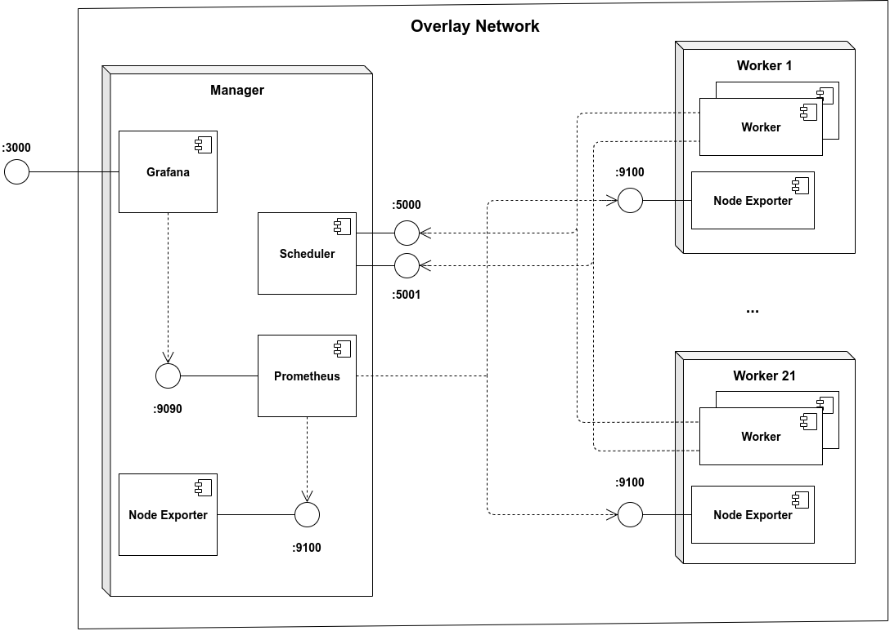

# Bachelor's final qualifying work

## Description
Repository contains my bachelor's final qualifying work at ITMO University. The work was about development of a distributed algorithm for object detection in video. Used technologies:
* asyncio
* OpenCV (with Tengine)
* ZeroMQ

https://user-images.githubusercontent.com/38363125/120944162-ad55a080-c73b-11eb-9120-7774d1460842.mp4

## Deployment
Developed algorithm was tested on a cluster with 22 single-board computers [ROCKPro64](https://wiki.pine64.org/wiki/ROCKPro64). To ease deployment process, Docker was installed on each node and then all nodes were joined in Docker Swarm.
Complete configs for deployment can be find in the [src/deploy](src/deploy) directory. A deployment diagram:

## Results
